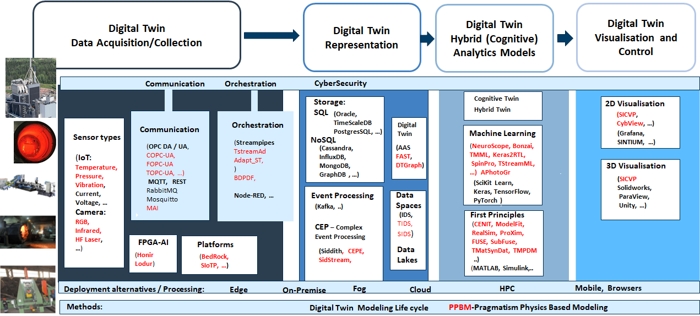

The COGNITWIN Toolbox is structured according to a defined Digital Twin pipeline, comprising a set of different Digital Twin (DT) supporting components. These component will typically be connected and configured together in different ways for different pipeline instances in various application contexts.

As shown in the figure, four main steps for the pipeline have been defined, corresponding to 1) DT data acquisition tools & services, 2) DT representation tools & services, 3) DT analytics tools & services, and 4) DT visualization and control tools & services that will be explained below.

